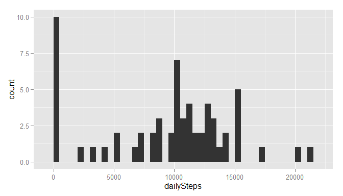
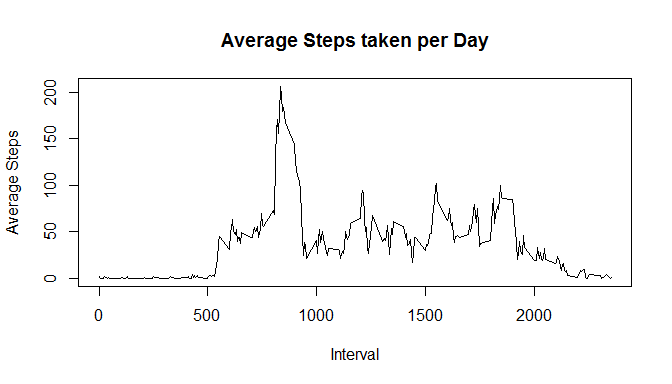
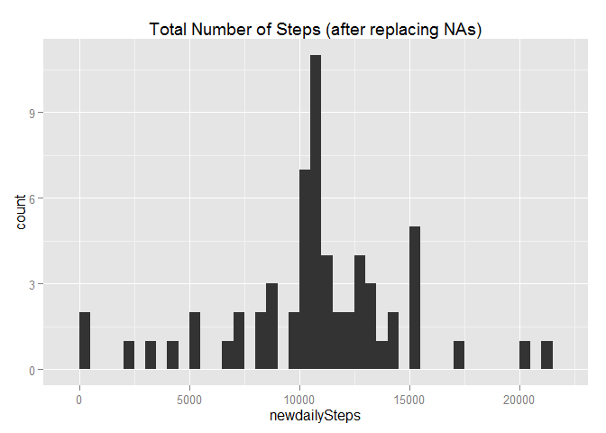

# Reproducible Research: Peer Assessment 1
###             by Rashid Chohan


```
## Warning: package 'knitr' was built under R version 3.2.2
```


## PART I

### 1. Loading and preprocessing the data

    Loading Activity data from Activity-Data file

  
### 2. Process/transform the data (if necessary) into a format suitable for your analysis

    No pre-processing of data is performed because we can make progress!

***
##Part II : 

### What is mean total number of steps taken per day?


###    1. Make a histogram of the total number of steps taken each day

 

###    2. Calculate and report the **Mean** and **Median** total number of steps taken per day

***


### For Total Number of steps taken per day:
###      **Mean** = **9354.2295082**  and 
###      **Median** = **10395**


***
##Part III

### What is the average daily activity pattern?

#### 1. Make a time series plot (i.e. `type = "l"`) of the 5-minute interval (x-axis) and the average number of steps taken, averaged across all days (y-axis)

 

#### 2. Which 5-minute interval, on average across all the days in the dataset, contains the maximum number of steps?


###    **Peak Time** is **835**, which corresponds to **Interval ** # **104** for the day.
    
***
##Part IV:    Imputing missing values

### 1. Calculate and report the total number of missing values in the dataset


### **Total Number of Missing** values = **2304**


#### 2. Devise a strategy for filling in all of the missing values in the dataset. 

#### IMPUTING STRATEGY :  
#### For each of the 5-minute Interval which has NA, we'll replace NA with **Mean Number of Steps (across all days)** .


#### 3. Create a new dataset that is equal to the original dataset but with the missing data filled in.


#### Assign **Average number of Steps** for each **interval with NA (value)**


###  4. Make a histogram of the total number of steps taken each day 
 

###     4.1) Calculate and report the **Mean** and **Median** total number of steps taken per day. 

### After imputing:
###      Now the **Mean** of steps taken per day is  **10766** 
###      and the **Median** of steps taken per day is **1.0766189\times 10^{4}**


###     4.2) Do these values differ from the estimates from the first part of the assignment? 
###   Yes, before the Mean was **9354.2295082**  and now it is **10766** 
###   While the Median has changed from **10395** to be **1.0766189\times 10^{4}**

###     4.3) What is the impact of imputing missing data on the estimates of the total daily number of steps?
              
###     Yes, the after imputing the **Mean** has shifted to higher (i.e. more) steps per day. ####     This is as expected since we added steps, which were missing in the data!

***
##Part V

### Are there differences in activity patterns between weekdays and weekends?

### **Yes, there are differences between Weekdays and Weekend activity***

Make a panel plot containing a time series plot (i.e. type = "l") of the 5-minute interval (x-axis) and the average number of steps taken, averaged across all weekday days or weekend days (y-axis).

 
